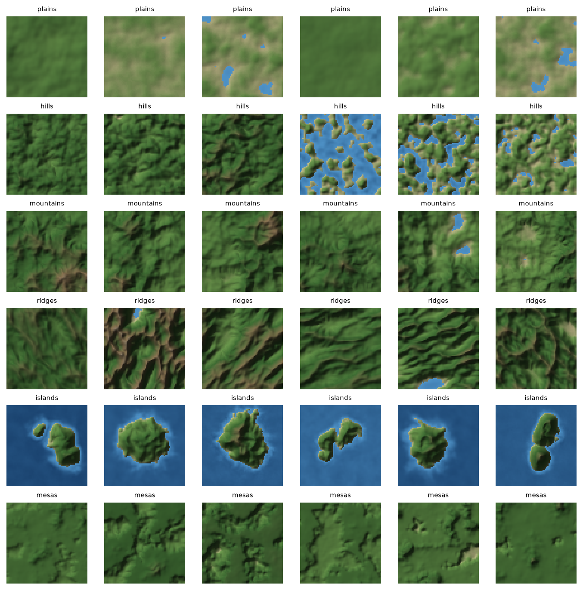
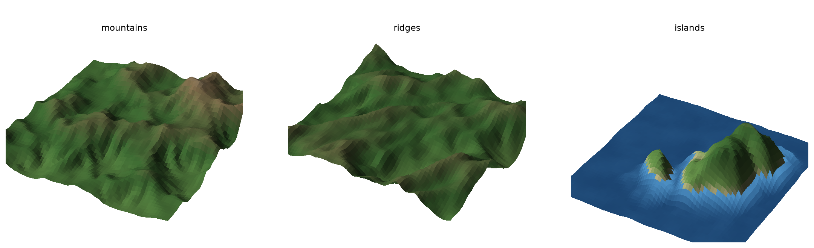

# Talus

Talus generates terrain heightmaps for games. You pick a terrain type and any of five measurable
properties (mean elevation, relief, slope, water coverage, roughness), and Talus draws a 64x64 map
covering 4 x 4 km with heights up to 1,200 m. It is a 23M-parameter conditional diffusion model that we
trained from scratch on 45,000 procedural maps generated by the code in this repository. It runs on an
8 GB consumer GPU, and on a CPU if you can wait a few seconds per map.



**Try it without installing anything at [talus.tersa.tech](https://talus.tersa.tech/)**: the model runs in your
browser on WebGPU (or the CPU) and exports PNG, Unity RAW and OBJ.

**Talus-3** is the first public release. Code and weights are under the [Apache-2.0 license](LICENSE).
Talus is the terrain model of NULLSCAPE, a game in development; the Python package and command-line
tool keep that name (`nullscape`).

## Quick start

You need Python 3.11+ and PyTorch 2.7+. Pick the PyTorch build for your machine at
[pytorch.org](https://pytorch.org/get-started/locally/); RTX 50-series cards need a CUDA 12.8 build.

```bash
git clone https://github.com/osfv/talus
cd talus
pip install torch --index-url https://download.pytorch.org/whl/cu128
pip install -e .
```

Download the weights (93 MB) into `checkpoints/`:

```bash
gh release download v3.0.0 --repo osfv/talus --pattern talus-3.pt --dir checkpoints
# without the GitHub CLI:
curl -L --create-dirs -o checkpoints/talus-3.pt https://github.com/osfv/talus/releases/download/v3.0.0/talus-3.pt
```

SHA-256 of `talus-3.pt`: `13b4297bd57b2305cfc30cdf934d22fb21bb241703b0565eacd7a76062b6a6d9`

Generate 16 island maps with 60% water and export them for Unity, Unreal or Godot:

```bash
nullscape sample --checkpoint talus-3 --archetype islands --prop water_fraction=0.6 \
    --n 16 --formats png16,r16,obj --unity --out exports/islands
```

Add `--device cpu` if you have no CUDA GPU. Each run writes the maps, a preview grid and `samples.json`
with every map's seed, settings and measured properties.



## What you can control

- **Terrain type** (`--archetype`): `plains`, `hills`, `mountains`, `ridges`, `islands`, `mesas`.
  Leave it out and Talus picks one.
- **Properties** (`--prop key=value`, any subset): `mean_elevation` and `relief` in normalized height
  (1.0 = 1,200 m), `mean_slope_deg`, `water_fraction` (share of cells below sea level), and
  `spectral_beta` (roughness: higher is smoother). Talus fills in whatever you leave open.
- **Seeds**: `--seed` sets a batch's root seed and `--seeds 42,99` sets per-map seeds. The same seed,
  settings and checkpoint give the same map.
- **Editing and tiling**: keep part of an existing map with `--reference terrain.npy --preserve-mask
  keep.npy`, lay out routes and flat areas with `--layout layout.json`, and grow seamless neighbors
  with `--neighbor-west tile.npy --overlap 4` (also north, east, south). See
  [Spatial editing](#spatial-editing).
- **Exports**: 16-bit PNG, little-endian RAW (`.r16`, Unity), `.npy` and OBJ meshes, each with a JSON
  sidecar giving the physical size. `--unity` resamples to Unity's 2^n+1 sizes.
  [docs/ENGINE_EXPORT.md](docs/ENGINE_EXPORT.md) has import steps for each engine.

`nullscape checkpoint-info --checkpoint talus-3` prints the model's world scale, sampler preset and
property statistics without sampling.

## Results

Scores on the held-out TEST split, 1,000 maps per half. Each score runs from 0 to 100, where 100
means indistinguishable from real procedural terrain at this sample size. Each version fine-tunes the
one before it ([docs/TALUS.md](docs/TALUS.md) lists them all).

| Benchmark | What it measures | Talus-1 | Talus-2 | **Talus-3** |
|---|---|---|---|---|
| Realism | 25 terrain metrics vs real maps | 34.4 | 56.5 | **66.2** |
| Spectrum | detail at every scale (power spectrum) | 3.6 | 7.6 | **11.0** |
| Heights | elevation distribution | 88.5 | 98.3 | **99.1** |
| Slopes | slope distribution | 41.2 | 56.4 | **60.5** |
| Control | requested vs measured properties | 81.8 | 90.4 | **92.1** |
| Playability | walkable-route pass rate vs real maps | 98.4 | 97.6 | **99.9** |
| Diversity | variety vs real maps | **96.9** | 94.4 | 95.0 |
| Originality | distance from the training maps | **100** | 98.1 | 99.1 |
| Clean detail | no excess micro-bumps | 58.4 | 97.7 | **99.4** |
| **Average** | | 67.0 | 77.5 | **80.3** |

Talus-3 samples 5.8 maps/s at batch 128 on an RTX 5060 (8 GB), or one map in 1.3 s.

- [docs/TALUS3.md](docs/TALUS3.md): how Talus-3 was trained and chosen, and what improved
- [docs/TALUS3_SCORECARD.md](docs/TALUS3_SCORECARD.md): the full scorecard with non-learned baselines
- [docs/compare/talus2-vs-talus3.html](docs/compare/talus2-vs-talus3.html): Talus-2 and Talus-3 side by
  side in 3D on the same TEST requests (download it and open it in a browser; it works offline)
- [docs/V1_BENCHMARK.md](docs/V1_BENCHMARK.md) and [docs/EVALUATION.md](docs/EVALUATION.md): the
  benchmark protocol

## How it works

- **Data.** A procedural generator in [`src/nullscape/terrain`](src/nullscape/terrain) builds each map
  from fBm, billow or ridged multifractal noise, then runs stream-power erosion, hillslope diffusion and
  thermal erosion. Each map is a pure function of its seed. The `base64` dataset has 50,000 maps, split
  45,000 / 2,500 / 2,500 into train, validation and test.
  [docs/DATASET.md](docs/DATASET.md) describes the pipeline.
- **Model.** A pixel-space U-Net denoiser (v-prediction, cosine noise schedule) conditioned on the
  terrain type and the five properties. Training drops each property at random, so the model learns
  every subset, and classifier-free guidance strengthens the conditioning at sampling time.
  [docs/MODEL_RESEARCH.md](docs/MODEL_RESEARCH.md) explains the design.
- **Relative heights.** Since Talus-2, the model draws a map's shape scaled by its own relief, and the
  sampler places that shape at the requested mean elevation and relief. When you leave those open, it
  borrows them from one of the 16 most similar training maps stored in the checkpoint. Flat plains
  stopped looking grainy after this change.
- **Sampling.** 50 DDIM steps with quadratic spacing and guidance 2.0, stored in the checkpoint as its
  default preset.
- **Evaluation.** Every distance between generated and real maps is divided by the same distance
  between two halves of real maps (the noise floor), so 1.0 means indistinguishable at that sample
  size. Checkpoints and sampler settings are chosen on the validation split; the test split only scores
  the final pick. [docs/EVALUATION.md](docs/EVALUATION.md) has the protocol.

## Limitations

- Talus only knows the procedural world it was trained on. It has never seen real elevation data.
- 64x64 cells at 64 m is coarse for close-up play; treat the output as a base layer for detail noise
  or upscaling.
- Mountains and ridges remain the weakest types, mesas got worse than in Talus-2, and the power
  spectrum is still 9x the noise floor, mostly at the finest scales.
- The roughness control (`spectral_beta`) is the loosest of the five properties.

## Roadmap

- **Talus-3.1**: two short continuations on the same data scored worse than Talus-3 and moved closer
  to the training maps. The next test continues on 96,000 freshly generated maps
  ([docs/TALUS3.md](docs/TALUS3.md#talus-31-so-far)).
- **Talus-4**: training on real terrain from the Copernicus GLO-30 elevation model
  ([docs/EARTH_DATA.md](docs/EARTH_DATA.md)).
- Larger maps (128x128) and a distilled few-step sampler.

## Development

The rest of this file is the reference for training and evaluating your own models.

### Setup on Windows

Keep the virtual environment outside synced folders such as OneDrive:

```powershell
py -3.13 -m venv "$env:USERPROFILE\.venvs\nullscape"
& "$env:USERPROFILE\.venvs\nullscape\Scripts\Activate.ps1"
pip install torch --index-url https://download.pytorch.org/whl/cu128
pip install -e .[dev]
```

Data lands in `data/` and runs in `runs/`; override with `NULLSCAPE_DATA_ROOT` and
`NULLSCAPE_RUNS_ROOT`.

### Workflow

```bash
# 1. Procedural datasets (deterministic, parallel)
nullscape gen-dataset --config configs/dataset/smoke.yaml              # 512 maps, sanity
nullscape gen-dataset --config configs/dataset/base64.yaml --workers 8 # 50k, 64x64
nullscape gen-dataset --config configs/dataset/base128.yaml            # 50k, 128x128

# 2. Inspect a dataset
nullscape viz --dataset base64 --split val --n 36 --out reports/base64

# 3. Train
nullscape train --config configs/train/smoke.yaml                      # tiny sanity run
nullscape train --config configs/train/diffusion64.yaml                # the Talus-1 recipe
nullscape train --config configs/train/diffusion64.yaml --set train.lr=1e-4
nullscape train --config configs/train/diffusion64.yaml \
    --resume runs/<run>/checkpoints/last.pt
tensorboard --logdir runs

# 4. Sample from a checkpoint (self-contained: weights + world + normalization)
nullscape sample --checkpoint talus-3 --n 16
nullscape sample --checkpoint ... --archetype islands \
    --prop relief=0.3 --prop water_fraction=0.4   # any subset of properties

# 5. Evaluate against held-out procedural data (noise-floor protocol)
nullscape evaluate --checkpoint ... --n 1000 \
    --modes conditional,label_only,unconditional \
    --guidance-sweep 1,1.5,2,3 --out reports/eval

# 6. Per-checkpoint visual artifacts (grids, 3D, spectra, histograms, adherence,
#    memorization, fixed-seed progression) -> artifacts/<run>/index.md
nullscape artifacts --run runs/<run>                 # render all step_*.pt snapshots
nullscape artifacts --run runs/<run> --watch         # follow a live run
nullscape sampler-sweep --checkpoint ... --out reports/sweep   # choose steps/spacing/eta/guidance

# 7. Side-by-side figures and engine exports
nullscape compare --checkpoint ... --n 6 --seeds 3 --out reports/compare
nullscape export --dataset base64 --index 123 --unity --out exports/
```

To fine-tune from the released weights, set `train.init_from: checkpoints/talus-3.pt` in a training
config. Release checkpoints contain the EMA weights only, which then seed both the raw and EMA copies.

### Checkpoints

```bash
nullscape checkpoints --limit 5
nullscape checkpoint-info --checkpoint talus-3
nullscape release-checkpoint --checkpoint runs/<run>/checkpoints/step_0012000.pt \
    --out checkpoints/my-model.pt --name My-Model --version 1.0.0
```

Checkpoint arguments accept an alias (`talus-3`, plus `talus-1`, `talus-1.1` and `talus-2` on the
machine that trained them), a `.pt` file, or a run folder. Sampling a run folder prefers `best.pt`,
then `last.pt`, then its last numbered snapshot. `train --resume` prefers `last.pt`.

Every checkpoint loads with `torch.load(weights_only=True)`, so opening one cannot run code from the
file. Training checkpoints also allow numpy arrays (RNG state). `release-checkpoint` writes a smaller
file for sharing: EMA weights, configs and dataset statistics, without the optimizer, raw weights,
training state or local paths.

### Sampling details

`--seed` sets a batch's root seed; `--seeds` supplies per-map seeds. Sample metadata includes
`sample_seed` for replay with the same checkpoint, properties, sampling settings, and spatial inputs.
The number of explicit seeds determines `--n` unless you supply a matching count. `--no-previews` skips
the grid and inspection plots but keeps exports and metadata.

Without `--out`, sampling creates a timestamped folder under `outputs/samples`. Sample, evaluate,
compare, sampler-sweep, and benchmark-sampling commands reject non-empty output folders. A
`.nullscape-output` marker reserves each folder; choose a fresh folder for a new attempt.

Sampling, evaluation, comparison, sweeps, and timing support `--device cpu|cuda` and
`--gpu-memory-fraction` (default 0.6). Input errors include suggested corrections where available; add
`--debug` for a traceback. Training rejects unknown option names and invalid step counts before
loading the dataset or allocating GPU memory.

Checkpoints carry a `sampling` preset; older ones default to 50 quadratic DDIM steps, guidance 2,
eta 0. Explicit CLI options override the preset. A guidance interval uses normalized noise timesteps:
0 is clean, 1 is noisy; outside the interval, guidance is 1. The default `[0,1]` keeps full guidance.

### Spatial editing

`sample --reference terrain.npy --preserve-mask keep.npy` preserves true cells of a `[R,R]`
boolean/0-1 mask during denoising. Both inputs use the checkpoint's resolution and physical scale.
Preserved heights remain exact float32 values. Hard spatial constraints can override requested global
properties; inspect the measured properties and transitions afterward.

`sample --layout layout.json` accepts cell-coordinate routes and flat areas, for example:

```json
{"routes": [{"points": [[32,4],[32,59]], "height": 0.3, "width_cells": 5}],
 "flat_areas": [{"center": [32,8], "height": 0.3, "radius_cells": 4}]}
```

Use `--neighbor-west tile.npy` (also north/east/south) with `--overlap 4` for matching tile strips.
Adjacent tile origins differ by `(resolution - overlap) * cell_size_m`; these are overlapping tiles,
not extra border padding. Conflicting constraints fail rather than silently changing preserved cells.
Seam heights match; check transition quality yourself.

### Experiment queue

`nullscape queue` runs matched experiments one stage at a time, each in its own process, so GPU
memory is released between stages:

```powershell
nullscape queue --plan configs/queue/talus31.yaml --check    # list stages; runs nothing
nullscape queue --plan configs/queue/talus31.yaml            # run; rerun the same command to continue
nullscape queue --plan configs/queue/talus31.yaml --status   # progress, from any terminal
```

The queue preflights each recipe, evaluates the baseline once on VAL, then trains, evaluates, and
builds a comparison page for each experiment in order. Output goes to `reports/queues/<name>/`:
`summary.md` (VAL table with mountains/ridges/plains ratios and links),
`comparisons/<experiment>/index.html`, `evaluations/`, `logs/`, and a snapshot of each training config
taken when the queue started. It does not select a winner, promote a checkpoint, or touch TEST.

- **Ctrl+C** pauses safely: training saves a recovery checkpoint first. Rerun the same command and
  training resumes exactly where it stopped. A crash or power cut resumes from the last periodic
  checkpoint.
- **A failed stage** stops the queue (log path in the error). Fix the cause, then add
  `--retry-failed`; training retries resume from their latest checkpoint.
- Editing the plan after the queue starts is rejected; use a new `--out`.
- Don't run another GPU job alongside the queue.

`train --dry-run` checks three forward/backward/optimizer/EMA steps, including optimizer-state memory,
without creating a run or writing a checkpoint.

### Training recovery

Checkpoints are written atomically (a crash mid-save leaves the previous file intact) and carry the
full training state: scheduler, RNG, batch sampler, and best score. Resume with
`train --config <same config> --resume <run folder or last.pt>`. Resuming continues in a new run
folder; the source run is never modified. Resume refuses a changed dataset, model, seed, or training
recipe; use `train.init_from` for intentional changes. Older checkpoints without this state need
`--allow-inexact-resume`. Ctrl+C during training finishes the current step, saves `last.pt`, and
prints the resume command; a second Ctrl+C stops immediately. Each run writes `status.json` (running,
completed, interrupted or failed).

`last.pt` is refreshed every `train.recovery_every` steps (default 1000), and always before that
step's previews and evaluation. Numbered `step_*.pt` snapshots still follow `checkpoint_every`. If a
failure happens outside the weight update (for example running out of GPU memory while previewing),
the trainer saves the completed step before exiting.

### Comparing two models

```powershell
nullscape comparison-report --baseline <evaluation A> --candidate <evaluation B> `
    --baseline-name Talus-2 --candidate-name Talus-3 --out reports/compare_talus3
```

Inputs are `evaluate` output folders (fully conditioned mode) or official artifact step folders such
as `benchmarks/v2/talus2/artifacts_official/step_0010000`. Both must use the same dataset, split,
reference halves, requests, seeds, and sampler settings; otherwise the command refuses. The
self-contained `index.html` shows both terrains in synchronized 3D views, whole-set metric changes,
spectra, slope distributions, and a gallery of representative cases, the candidate's worst control
adherence, and its largest regressions. It samples nothing and works offline.

```powershell
nullscape sampler-sweep --checkpoint <checkpoint> --n 500 --steps-list 50,25 --spacings quadratic --etas 0 --guidances 2 --guidance-intervals 0:1,0.05:0.8 --out reports/new_sweep
nullscape evaluate --checkpoint <checkpoint> --n 500 --repeat-seeds 0,1,2 --out reports/new_eval
nullscape compare --checkpoint <checkpoint> --blind --out reports/new_blind
nullscape benchmark-sampling --checkpoint <checkpoint> --batches 1,32,64,128 --out reports/new_perf
```

Evaluation includes fully conditioned, label-only, unconditional, and each property-only request by
default. Gameplay results measure fixed-endpoint reachability, route width, bottlenecks, and flat
combat space, separately from the frozen scorecard. Keep the blind comparison's `blind_key.json` away
from reviewers. Speed measurements belong to the measured checkpoint; pass
`--perf-json .../performance.json` to `benchmarks/v2/score_test.py` or leave speed unmeasured. The
first sampler-sweep configuration is the regression-gate baseline.

### Real terrain (Talus-4 data)

`nullscape.data.earth` builds datasets from the Copernicus GLO-30 elevation model in the standard
dataset format. It needs `tifffile` (`pip install -e .[earth]`).

```powershell
python -m nullscape.data.earth tiles --config configs/dataset/earth64_sample.yaml
python -m nullscape.data.earth build --config configs/dataset/earth64_sample.yaml --workers 2
```

Train, validation and test are split by geographic region. Downloads go to
`%LOCALAPPDATA%\nullscape\dem_cache` and are refused above `--max-gb`. Anything shared from this data
must carry the Copernicus attribution. Details, findings and required Talus-4 changes:
[docs/EARTH_DATA.md](docs/EARTH_DATA.md).

`configs/dataset/game64.yaml` defines a separate 512 m, 64-cell dataset experiment (8 m/cell). It does
not replace `base64` or change existing checkpoints' scale.

### Website (talus.tersa.tech)

`site/` is the static page that runs Talus in the browser with ONNX Runtime Web. The JavaScript sampler
(`site/src/js/sampler.js`) reproduces the PyTorch sampler: `npm test` compares both on reference samples.

```powershell
pip install -e .[web]
python scripts/export_web.py --checkpoint talus-3 --out site/public/model   # ONNX model, metadata, test fixtures
cd site
npm install
npm test             # sampler parity with PyTorch, exports
npm run dev          # http://127.0.0.1:4173/
```

Pushes to `master` that touch `site/` deploy it with GitHub Actions (`.github/workflows/site.yml`). The workflow
downloads `talus-3.fp16.onnx`, `talus-3.json` and `talus-3.prior.bin` from the v3.0.0 release. The fp16 file stores
weights at half precision but computes in fp32; its samples stay within 6 m of PyTorch's.

### Playable demo

`demo/nullscape-demo.html` is a self-contained first-person "daily run" through 30 maps generated by
Talus-1. Open it in a browser (WebGL2): the date picks the daily map, cyan beacons mark the walkable
route, and a pillar of light marks the goal. Rebuild it with `python demo/build_demo.py`.

### Layout

```
configs/dataset/    dataset build configs (smoke, base64, base128, earth, game64)
configs/train/      training recipes (smoke, diffusion64, Talus-2/3/3.1 fine-tunes)
configs/queue/      experiment queue plans
benchmarks/         TEST scoring scripts, results and scorecards
docs/               model reports, dataset/evaluation/export docs, blog posts
src/nullscape/
  world.py          WorldSpec: physical meaning of normalized heightmaps
  terrain/          noise, erosion, archetypes, generate()
  metrics/          per-map quality metrics, traversability, distribution distances
  data/             dataset build (multiprocessing), storage, splits, real-terrain builder
  models/           UNet, GaussianDiffusion, EMA, height parameterization
  train/            training loop, recovery, experiment queue
  inference/        TerrainSampler (checkpoint -> heightmaps), spatial constraints
  eval/             evaluation protocol, artifacts, comparison pages, timing
  viz/              hillshade/color/traversability/3D rendering
  export/           png16 / r16 / npy / OBJ engine exports
  utils/            config, seeds, run tracking, paths, checkpoint loading
tests/              pytest suite (CPU)
```

### Reproducibility

- Every procedural map is a pure function of `(seed, index, world, generator config)` via
  `np.random.SeedSequence([seed, index])`, identical regardless of worker count or order.
- Each dataset manifest records the resolved config and its sha256, the generator version, git commit
  and dirty flag, and library versions.
- Each training run gets `runs/<timestamp>_<name>/` with `config.yaml`, `env.json`, `model.json`,
  `metrics.jsonl`, TensorBoard events, samples, eval reports, and checkpoints.
- Checkpoints are self-contained: UNet/diffusion configs, EMA weights, the dataset's world spec,
  condition keys, train-split normalization stats and archetypes, so sampling needs no data on disk.

### Testing

```bash
python -m pytest                 # full suite (CPU)
python -m pytest -m "not slow"   # skip the end-to-end train/eval tests
```

## License

Code and model weights: [Apache License 2.0](LICENSE). The procedural training data comes from this
repository's generator. The Talus-4 tooling downloads Copernicus GLO-30 data, which has its own
attribution terms ([docs/EARTH_DATA.md](docs/EARTH_DATA.md)).
