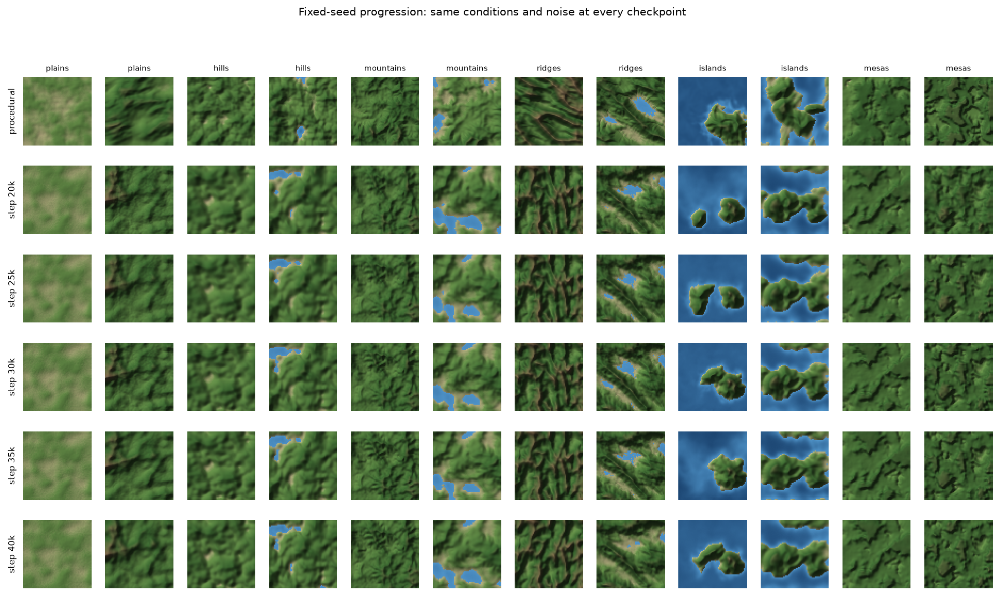
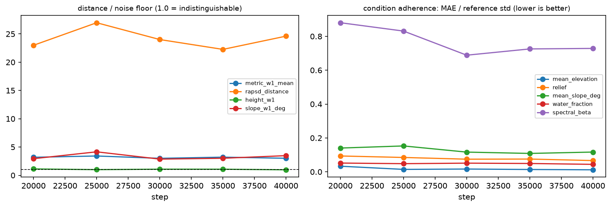

# Checkpoint artifacts: artifacts_test

Sampler: 200 DDIM steps (uniform), eta 0.0, guidance 1.5; 1000 maps per half from `test`; fixed-seed set = 2 per archetype.

| step | ratio metric_w1_mean | ratio rapsd_distance | ratio height_w1 | ratio slope_w1_deg | mean nMAE | NN ratio | trav pass (gen/ref) | dir |
|---|---|---|---|---|---|---|---|---|
| 20000 | 3.19 | 22.99 | 1.13 | 2.94 | 0.240 | 1.00 | 0.91/0.92 | [step_0020000](step_0020000/summary.md) |
| 25000 | 3.42 | 26.98 | 1.01 | 4.15 | 0.226 | 1.02 | 0.91/0.92 | [step_0025000](step_0025000/summary.md) |
| 30000 | 3.00 | 24.00 | 1.09 | 2.86 | 0.189 | 1.01 | 0.91/0.92 | [step_0030000](step_0030000/summary.md) |
| 35000 | 3.21 | 22.26 | 1.08 | 3.02 | 0.195 | 1.01 | 0.91/0.92 | [step_0035000](step_0035000/summary.md) |
| 40000 | 3.01 | 24.61 | 0.97 | 3.48 | 0.194 | 0.98 | 0.91/0.92 | [step_0040000](step_0040000/summary.md) |
