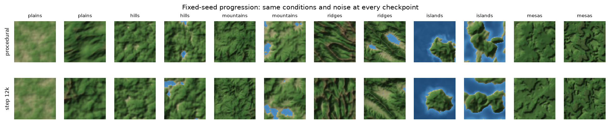
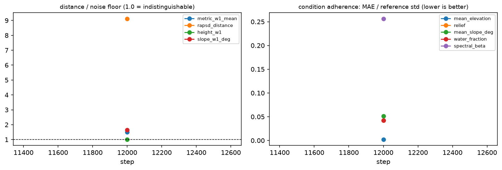

# Checkpoint artifacts: artifacts_official

Sampler: 50 DDIM steps (quadratic), eta 0.0, guidance 2.0; 1000 maps per half from `test`; fixed-seed set = 2 per archetype.

| step | ratio metric_w1_mean | ratio rapsd_distance | ratio height_w1 | ratio slope_w1_deg | mean nMAE | NN ratio | trav pass (gen/ref) | dir |
|---|---|---|---|---|---|---|---|---|
| 12000 | 1.51 | 9.12 | 1.01 | 1.65 | 0.079 | 0.99 | 0.92/0.92 | [step_0012000](step_0012000/summary.md) |
