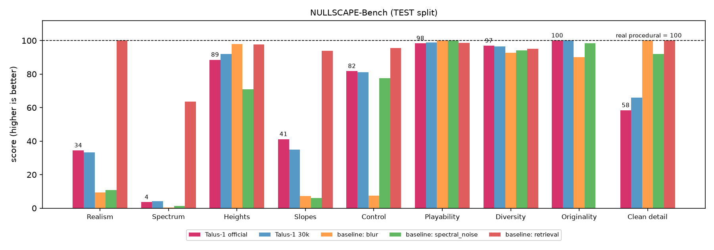

# NULLSCAPE v1 benchmark (Talus-1)

The official v1 configuration is named **Talus-1**; see [`TALUS.md`](TALUS.md) for versions.

Frozen benchmark of the v1 terrain model: a 23.2M-parameter conditional pixel-space diffusion
U-Net trained on 64x64 procedural heightmaps. Nothing was retrained, fine-tuned or regenerated
for this benchmark. Checkpoints and the dataset were set read-only before any run.

- Plain-English summary: [`V1_SUMMARY.md`](V1_SUMMARY.md)
- Scorecard (0-100, with baselines): [`BENCHMARK_SCORECARD.md`](BENCHMARK_SCORECARD.md)
- Machine-readable results: [`../benchmarks/v1/results.json`](../benchmarks/v1/results.json)
- Every table below, plus more: [`../benchmarks/v1/tables.md`](../benchmarks/v1/tables.md) (generated from results.json)
- Bugs found (not fixed during the benchmark): [`../benchmarks/v1/BUGS.md`](../benchmarks/v1/BUGS.md)

## Official v1 baseline

| | |
|---|---|
| Checkpoint | **step 30000**, `runs/20260925-164759_diffusion64/checkpoints/step_0030000.pt` (sha256 `1717b9f7…cb30`) |
| Sampler | **50-step DDIM, quadratic spacing, guidance 2.0, eta 0** |
| Why this checkpoint | Lowest VAL metric-W1 ratio (3.16). 40k was within the 0.05 tie margin but had a worse mean headline ratio (4.43 vs 4.36). On TEST, 30k and 40k tie (3.00 vs 3.01); 30k has the best slope and conditioning scores, and bootstrap P(best) is 0.66 vs 0.34. |
| Why this sampler | Pre-registered rule: fastest configuration within 5% of the best VAL quality. It is on the measured Pareto frontier, **4.0x faster** than the 200-step default (5.48 vs 1.38 maps/s) with better realism, slopes and control on TEST. It trades away some spectral fidelity and adds micro-bumps (see sampler section). |

Headline (TEST, 1000 maps per half, official configuration):

| distance | learned vs real | real vs real (noise floor) | ratio |
|---|---|---|---|
| metric W1 mean (25 metrics) | 0.1437 | 0.0495 | 2.90x |
| RAPSD distance (decades) | 0.2880 | 0.0103 | 28.0x |
| height W1 (normalized) | 0.0095 | 0.0084 | 1.13x |
| slope W1 (deg) | 0.608 | 0.250 | 2.43x |

Conditioning nMAE (MAE / reference std):
- mean elevation 0.017
- relief 0.074
- mean slope 0.111
- water fraction 0.052
- spectral beta 0.657

Other headline measures:
- **Traversability pass:** 0.902 learned vs 0.917 real.
- **Diversity:** 0.1611 vs 0.1662.
- **Nearest-training-neighbour median ratio:** 1.013 (no memorization).
- **Speed:** 5.48 maps/s at batch 128 on an RTX 5060.



## 1. Checkpoints (TEST)

Same sampler for all checkpoints (200-step DDIM, uniform, guidance 1.5, eta 0), same seeds and conditions.

| step | metric W1 ratio | RAPSD ratio | height W1 ratio | slope W1 ratio | RAPSD bias (dec) | slope W1 excess (deg) | adherence nMAE | trav pass gen/ref | diversity gen/ref | NN ratio |
|---|---|---|---|---|---|---|---|---|---|---|
| 20000 | 3.19 | 23.0 | 1.13 | 2.94 | 0.236 | 0.49 | 0.240 | 0.911/0.917 | 0.1632/0.1662 | 1.005 |
| 25000 | 3.42 | 27.0 | 1.01 | 4.15 | 0.277 | 0.79 | 0.226 | 0.911/0.917 | 0.1595/0.1662 | 1.022 |
| **30000** | **3.00** | 24.0 | 1.09 | **2.86** | 0.246 | **0.47** | **0.189** | 0.907/0.917 | 0.1605/0.1662 | 1.015 |
| 35000 | 3.21 | 22.3 | 1.08 | 3.02 | 0.228 | 0.50 | 0.195 | 0.912/0.917 | 0.1601/0.1662 | 1.011 |
| 40000 | 3.01 | 24.6 | 0.97 | 3.48 | 0.253 | 0.62 | 0.194 | 0.905/0.917 | 0.1595/0.1662 | 0.978 |

Noise floor (A vs B, TEST): metric W1 0.0495, RAPSD 0.0103 decades, height W1 0.0084, slope W1 0.250 deg.

| step | checkerboard gen/ref | hf_energy gen/ref | peak density gen/ref | sink density gen/ref |
|---|---|---|---|---|
| 20000 | 0.0004/0.0005 | 0.0040/0.0062 | 16.18/11.93 | 11.18/8.40 |
| 25000 | 0.0004/0.0005 | 0.0037/0.0062 | 16.58/11.93 | 11.78/8.40 |
| 30000 | 0.0005/0.0005 | 0.0048/0.0062 | 18.06/11.93 | 12.81/8.40 |
| 35000 | 0.0004/0.0005 | 0.0046/0.0062 | 17.16/11.93 | 12.36/8.40 |
| 40000 | 0.0005/0.0005 | 0.0054/0.0062 | 18.56/11.93 | 12.50/8.40 |

| step | plains | hills | mountains | ridges | islands | mesas |
|---|---|---|---|---|---|---|
| 20000 | 3.51 | 2.42 | 3.25 | 3.62 | 2.07 | 2.21 |
| 25000 | 3.57 | 2.91 | 2.98 | 3.46 | 2.24 | 2.05 |
| 30000 | 3.75 | 2.98 | 2.73 | 2.78 | 1.72 | 2.05 |
| 35000 | 3.74 | 2.83 | 2.79 | 3.18 | 1.99 | 2.22 |
| 40000 | 3.91 | 2.64 | 2.64 | 2.85 | 2.13 | 1.73 |

Findings:
- **Training plateaued by about 20k steps.** Differences between 20k and 40k are small and
  not monotonic. Metric W1 ranges 3.00-3.42, and the ranking is 30k ≈ 40k < 20k ≈ 35k < 25k.
- **Bootstrap (300 paired resamples):** P(best on metric W1) is 0.66 for 30k, 0.34 for 40k,
  and 0 for the others.
  - Bootstrap *levels* are biased low: resampling with replacement inflates the real-vs-real
    floor. They are only used for this paired ranking; use the point estimates above for levels.
- **Checkerboard artifacts are absent at every step** (equal to the reference). The nearest-neighbour
  upsampling design works.
- **Micro-relief worsens slightly with training:** sink density goes from 11.2 (20k) to 12.8
  (30k) to 12.5 (40k), against 8.4 real.
- **Conditioning improves** from 0.240 nMAE (20k) to about 0.19 (30k+).

Visual suite for every checkpoint (same 12 fixed maps, not chosen by eye):
`../benchmarks/v1/artifacts_test/step_00X0000/`. It contains:
- `procedural_vs_learned.png`
- `compare_3d.png`
- `rapsd.png`
- `metric_histograms.png`
- `condition_adherence.png`
- `nearest_neighbors.png`
- `traversability.png`
- `summary.md`

Fixed-seed progression across checkpoints: `../benchmarks/v1/artifacts_test/progression.png`.
The official configuration's suite: `../benchmarks/v1/artifacts_official/step_0030000/`.

## 2. Sampler benchmark

**Grid:** 20 configurations on VAL (500 maps/half, checkpoint 30k):
- steps 25/50/100/200 × uniform/quadratic spacing at guidance 1.5
- guidance 1.0/2.0/3.0
- eta 0.5/1.0

**Cost:** measured in isolation (section 8). Cost depends only on step count and whether
guidance is on. Figure: `../benchmarks/v1/figures/sampler_pareto.png`. Fixed-seed visual
comparison: `../benchmarks/v1/figures/sampler_fixed_seed_grid.png`.

**Pareto frontier (VAL quality vs isolated ms/map):**

| config | ms/map | VAL metric W1 ratio |
|---|---|---|
| 50 quadratic, g1.0 | 93 | 2.55 |
| 25 quadratic, g1.5 | 94 | 2.45 |
| **50 quadratic, g2.0** | 183 | 1.95 |
| 100 quadratic, g2.0 | 361 | 1.90 |

TEST confirmation (1000 maps/half):

| config | metric W1 ratio | RAPSD ratio | height W1 ratio | slope W1 ratio | adherence nMAE | trav pass gen | hf_energy gen | sink density gen | maps/s |
|---|---|---|---|---|---|---|---|---|---|
| s200 uniform g1.5 (default) | 3.00 | 24.0 | 1.09 | 2.86 | 0.189 | 0.907 | 0.0048 | 12.81 | 1.38 |
| s50 quadratic g1.0 | 3.55 | **21.7** | **0.99** | 4.67 | 0.219 | 0.917 | 0.0043 | **11.60** | 10.74 |
| s25 quadratic g1.5 | 3.66 | 24.4 | 1.17 | 5.09 | 0.229 | 0.909 | 0.0050 | 12.44 | 10.67 |
| **s50 quadratic g2.0 (official)** | 2.90 | 28.0 | 1.13 | 2.43 | 0.182 | 0.902 | 0.0061 | 14.64 | 5.48 |
| s100 quadratic g2.0 | **2.82** | 28.9 | 1.12 | **1.93** | **0.177** | 0.904 | 0.0062 | 15.05 | 2.77 |

Reference: hf_energy 0.0062, sink density 8.40.

Findings:
- **Quadratic spacing beats uniform at equal steps** on VAL metric W1 at every step count
  (e.g. 50 steps: 2.13 vs 2.44), because more steps land at low noise.
- **Guidance is a real trade-off.** Raising it from 1.0 to 2.0 improves realism, slopes and
  control, but *worsens* the spectrum (RAPSD 21.7 to 28.0) and adds micro-bumps (sinks 11.6
  to 14.6). Guidance 3.0 is worse than 2.0 on realism, spectrum and slopes (VAL metric W1
  2.05/2.41 vs 1.95/1.90).
- **eta > 0 (stochastic sampling) does not help** at guidance 1.5 (VAL 2.07-2.63 vs 2.03 at eta 0).
- **200 steps is never on the frontier.** 50 quadratic steps at guidance 2.0 match or beat the
  200-step default on realism, slopes and control at 4x the speed.
- **If spectrum matters most**, use 50 quadratic steps at guidance 1.0. It has the best RAPSD,
  heights and micro-relief, runs at 10.7 maps/s, and has worse realism and slopes.

## 3. Fixed-seed visual benchmark

- **Settings:** identical initial noise, conditions, labels and sampler at every checkpoint.
- **Maps:** the first 2 TEST maps of each archetype.
- **Progression:** `../benchmarks/v1/artifacts_test/progression.png` (row 1 = procedural reference).
- **Per checkpoint:** grids, 3D comparisons, RAPSD, histograms, adherence scatter,
  nearest-neighbour panels and traversability overlays in each `step_*` folder.
- **Visually:** by 20k the learned samples have the right large-scale structure for every
  archetype. From 30k to 40k the same seed gives nearly the same map, confirming convergence.
  Visible differences from procedural:
  - fine texture on flat plains
  - softened mesa cliff edges
  - smoother island coastlines

## 4. Conditioning stress tests

All stress tests use checkpoint 30k with the official sampler. Levels are the 5th/50th/95th
train percentiles; water uses the median of non-zero values for "mid". Full tables are in
`tables.md`. Figures in `../benchmarks/v1/figures/`:
- `stress_single_property.png`
- `stress_interference.png`
- `stress_archetype_gain.png`

**One property given, archetype unknown (64 maps per case):**
- **Mean elevation** is precise at all levels (nMAE 0.02-0.09).
- **Relief** is precise at low and mid (0.04, 0.13) and overshoots at high (+0.034, nMAE 0.31).
- **Mean slope** is precise at all levels (nMAE 0.10-0.17).
- **Water fraction** works at 0 but fails when given alone:
  - requested 0.108, got 0.016
  - requested 0.877, got 0.533 (nMAE 1.19)
  - With the full condition set it is accurate (nMAE 0.05), so water needs the other properties
    or the archetype.
- **Spectral beta** is compressed toward the middle: 3.41 gives 4.05, 7.12 gives 5.90.

**Unintended side effects.** When only "flat" is requested (low slope or low relief), the output
has much lower spectral beta than real flat terrain (-3.0 and -1.9 std versus train maps with the
same slope or relief). The model makes flat maps with rough micro-texture. This is the same
plains failure seen everywhere else.

**Pairs at the 5th/95th percentiles (32 maps per case):**
- **Combinations seen in training data barely interfere with each other.** Among mean
  elevation, relief, slope and water, the worst extra error from adding a second property is
  ≤ 0.15 std. The one exception is water paired with spectral beta (+0.69 std).
- **Spectral beta is the exception.** Its error rises by +1.6 to +2.0 std when paired with relief
  or slope, even for combinations with 800+ training examples.
- **Contradictory combinations that never occur in training are resolved in favour of mean
  elevation and relief.** For example:
  - mean elevation at the 5th percentile (below sea level) with water = 0 gives water nMAE 2.83
  - high relief with low slope gives relief nMAE 2.09

**Partial conditioning from real TEST maps.** More known properties means better adherence for
relief, slope and water:
- water nMAE 0.375 with 1 known property, 0.064 with 5
- mean elevation is good even alone (0.031)
- spectral beta stays about 0.6 whatever else is known

**Within-archetype control gain** (label known; request the archetype's own p10 vs p90;
1 = perfect):
- **Mean elevation** 1.01-1.11 in every archetype.
- **Relief** 0.96-1.36.
- **Slope** 0.85-1.13.
- **Water** 0.32-0.53 where water varies (weak). It is 0 for plains and ridges, which have
  almost no water to vary.
- **Spectral beta** is uncontrollable for plains (-0.04) and islands (0.25), partial for hills,
  ridges and mesas (0.69-0.82), and good only for mountains (1.05).

**Requested-value bins (full conditioning, default sampler):**
- **Four properties** are accurate across their whole range (bias within ±0.09 std).
- **Spectral beta regresses to the mean:** +0.45 std bias in the lower two thirds, -0.63 std in
  the top third.

## 5. Archetypes

TEST, checkpoint 30k, default sampler. Figure: `../benchmarks/v1/figures/archetype_failure_heatmap.png`.

| archetype | metric W1 ratio | RAPSD ratio | slope W1 ratio | adherence nMAE | trav pass gen/ref | hf_energy gen/ref | sink gen/ref | worst metrics |
|---|---|---|---|---|---|---|---|---|
| plains | 3.75 | 26.8 | 5.76 | 0.380 | 1.00/1.00 | 27.21 | 4.55 | curvature_std, spectral_beta, peak_density |
| hills | 2.98 | 20.7 | 2.84 | 0.206 | 0.96/0.98 | 0.26 | 0.72 | curvature_std, spectral_beta, peak_density |
| mountains | 2.73 | 4.0 | 2.07 | 0.135 | 1.00/1.00 | 0.45 | 1.38 | spectral_beta, checkerboard, hf_energy |
| ridges | 2.78 | 9.8 | 8.74 | 0.126 | 0.97/0.95 | 0.48 | 1.28 | hf_energy, curvature_std, spectral_beta |
| islands | 1.72 | 4.2 | 0.89 | 0.185 | 0.57/0.59 | 0.46 | 1.02 | peak_density, spectral_beta, hf_energy |
| mesas | 2.05 | 3.8 | 0.86 | 0.108 | 0.99/0.99 | 0.60 | 1.37 | peak_density, spectral_beta, sink_density |

Largest contributor to each failure. These come from leave-one-archetype-out deltas and error
shares; there are no subjective scores.

| failure | rank 1 | rank 2 | rank 3 |
|---|---|---|---|
| spectrum error | **plains** | hills | islands |
| slope error | **ridges** | mountains | hills |
| conditioning error | **plains** (32% of all error) | hills (19%) | islands (18%) |
| traversability failures (excess over real) | **islands** (+2.2 pp) | hills (+1.8 pp) | plains (0) |
| high-frequency artifacts | **plains** (100% of the excess) | - | - |
| micro-sinks | **plains** (66%) | mesas (17%) | mountains (10%) |
| overall metric ratio | **plains** | hills | ridges |

Spectrum error by frequency (mean log10 power, learned minus procedural):

| | k1-4 (>1 km) | k5-12 (340-820 m) | k13-24 (170-315 m) | k25-32 (128-165 m) |
|---|---|---|---|---|
| all maps | +0.01 | -0.15 | -0.14 | +0.39 |
| plains | -0.06 | -0.59 | +0.88 | **+3.47** |
| hills | +0.04 | -0.11 | -0.61 | +0.08 |
| mountains | -0.04 | -0.10 | -0.36 | -0.37 |
| ridges | +0.00 | -0.03 | -0.25 | -0.40 |
| islands | +0.03 | -0.07 | -0.29 | +0.14 |
| mesas | +0.11 | +0.06 | -0.06 | -0.38 |

(floor: ≤ 0.013 in every band). Figure: `../benchmarks/v1/figures/spectrum_error_by_frequency.png`.

**Mesas are not the weak archetype.** They are 2nd best overall (2.05), with the best spectrum
(3.8), slopes at the noise floor (0.86) and the best conditioning (0.108). Their real weaknesses:
- slightly too many micro-sinks (1.37x)
- missing finest-scale detail (-0.38 decades), which shows as softened cliff edges

**Plains are clearly the weakest,** and they drive most of the spectrum, conditioning,
high-frequency and micro-sink error:
- finest-scale power is 3,000x too high (+3.47 decades): noise on terrain that should be smooth
- 27x the reference high-frequency energy
- 4.6x the reference sink density

**The rugged archetypes fail the opposite way.** Mountains, ridges and mesas are too *smooth* at
fine scale, and ridges have the worst slope distribution (8.7x the floor).

**The global spectrum hides this.** In the all-maps average, plains' excess cancels part of the
rugged archetypes' deficit. Leave-one-out deltas are negative for every archetype except plains:
removing any other archetype makes the global number *worse*. Per-archetype spectra are the
meaningful diagnostic.

## 6. Memorization and generalization

Checkpoint 30k, all 1000 generated TEST-condition maps and 1000 held-out TEST maps, nearest
neighbour among 45,000 training maps under all 8 rotations/reflections.

| set | p0.1 | p1 | p5 | p10 | p50 | p90 |
|---|---|---|---|---|---|---|
| generated | 0.0065 | 0.0073 | 0.0097 | 0.0136 | 0.0438 | 0.0775 |
| held-out test | 0.0066 | 0.0080 | 0.0105 | 0.0142 | 0.0432 | 0.0770 |

- **nn_median_ratio is 1.015.** Per archetype it ranges 0.98-1.03. The official sampler gives
  1.013 and every checkpoint is between 0.978 and 1.022.
- **Tail:**
  - 2.4% of generated maps fall below the held-out 1st percentile (1% expected).
  - One map (0.1%) falls below the held-out minimum (0.0057 vs 0.0063, about 7 m RMS).
- **The 12 most suspicious maps**, by per-archetype percentile, are in
  `../benchmarks/v1/figures/memorization_most_suspicious.png`, aligned to their nearest training
  map with 5x difference panels.
  - They are generic low-relief or single-island maps whose nearest training map is similar but
    structurally different. None is a copy.
  - The small tail excess is consistent with the model concentrating near common terrain types.
- **Distribution:** `../benchmarks/v1/figures/memorization_nn_hist.png`.

## 7. Engineering

Full log: `../benchmarks/v1/raw/engineering.json`.

- **pytest:** 90 tests, 0 failures, 54 s (CPU).
- **CLI smoke tests:** every functional command ran with exit code 0, with one exception noted
  below:
  - `gen-dataset`, `viz`, `export --unity`
  - `sample --unity` (CPU, 30k checkpoint)
  - `evaluate`, `compare`, `sampler-sweep`
  - `train` (smoke)
  - The one exception is `artifacts` on the 24-map toy dataset, which fails with bug B3.
    `artifacts` on real datasets is exercised by this benchmark itself.
- **Dataset:**
  - manifest config hash reproduces
  - splits are disjoint and cover the dataset
  - `TerrainDataset` loads
- **Deterministic generation:** 100/100 randomly chosen maps regenerated from
  `(seed, index)` are **bit-identical** to the stored uint16 maps, with matching labels.
  - Stored conditioning values equal the float-map measurements exactly.
  - Re-measuring after uint16 storage changes spectral beta by up to 0.19 on very smooth maps
    (note N2). Re-scoring the model's output after uint16 quantization changes its ratios by
    ≤ 0.01.
- **Exports:**
  - PNG16, R16 (8,192 bytes) and NPY round-trip exactly.
  - OBJ has 4096/4096/7938 v/vn/f as expected, heights within 0.5 mm.
  - The metadata sidecar is present.
- **Sampler determinism on GPU:**
  - The same seed and batch size gives bit-identical output.
  - Different batch sizes differ by at most 0.0035 (4.1 m) in single pixels, from different bf16
    kernels. CPU sampling is batch-invariant (unit tests).
- **Unity sizing** (bug B1):

| input | unity_size | already 2^n+1 | upsampled although valid |
|---|---|---|---|
| 64 | 65 | no | no |
| 65 | 129 | yes | **yes** |
| 128 | 129 | no | no |
| 129 | 257 | yes | **yes** |
| 257 | 513 | yes | **yes** |
| 513 | 1025 | yes | **yes** |
| 1025 | 2049 | yes | **yes** |

`513 -> 1025` is **not intended**. The function returns the smallest `2^n + 1` strictly greater
than the input, so every size that is already valid is upsampled to 4x the file for no added
detail. The tests and docs currently encode this. The current 64/128 outputs are unaffected.
Documented as B1 with the other findings (B2-B4, N1-N2) in `BUGS.md`. None were changed during
the benchmark.

## 8. Performance (measured on this machine)

- **Hardware and software:** RTX 5060 8 GB (driver 616.56), bf16 autocast, torch 2.11.0+cu128,
  Windows 11.
- **How it was measured:**
  - isolated (no other GPU work)
  - PyTorch VRAM capped at 60%, so over-budget configurations report OOM instead of silently
    spilling to system RAM
  - one warm-up per shape

| steps | guidance | batch 1 latency (s/map) | batch 32 maps/s | batch 128 maps/s | batch 256 maps/s | peak alloc @128 |
|---|---|---|---|---|---|---|
| 25 | off | 0.83 | 21.1 | 20.9 | 21.4 | 1.4 GB |
| 25 | on | 0.74 | 11.0 | 10.7 | OOM | 2.6 GB |
| 50 | off | 1.47 | 10.2 | 10.7 | 10.8 | 1.4 GB |
| **50** | **on (official)** | 1.84 | 5.4 | **5.5** | OOM | 2.6 GB |
| 100 | off | 2.78 | 5.4 | 5.3 | 5.3 | 1.4 GB |
| 100 | on | 2.81 | 2.8 | 2.8 | OOM | 2.6 GB |
| 200 | off | 5.64 | 2.8 | 2.7 | 2.8 | 1.4 GB |
| 200 | on | 6.22 | 1.4 | 1.4 | OOM | 2.6 GB |

- **Throughput is linear in steps.** Guidance halves it.
- **Batching:** batch 32 already saturates the GPU. Single-map latency is about 15x worse per map.
- **Guidance at batch 256** (512 effective) needs more than 4.9 GB, OOM under the cap. An
  uncapped first attempt spilled to system RAM and ran about 20x slower; those numbers were
  discarded.
- **Other costs:**
  - checkpoint load 1.0 s
  - `compute_metrics` 2.1 ms/map, traversability 0.9 ms/map (CPU)
- **Peak process RAM:**
  - 1.06 GB after loading torch and the checkpoint
  - 1.94 GB after sampling 128 maps
  - 4.09 GB with the 45k-map training bank loaded (memorization checks)
- **Training throughput, from the run logs** (batch 48):
  - median 4.27 it/s (206 maps/s) for 0-30k; 4.30 it/s for 30-40k
  - 8-11% of logging intervals are slower because of in-training evaluation and sampling
  - 2.2 h wall-clock for 0-30k
- **Dataset build (from the manifest):** 50,000 maps in 2,707 s with 11 workers (18.5 maps/s).

## v1 weaknesses (measured)

1. **Noise on flat terrain.** Plains have 3,000x too much finest-scale power, 27x the
   high-frequency energy and 4.6x the micro-sinks. The model cannot produce very smooth maps:
   the curvature distribution never reaches the plains' near-zero values.
2. **Rugged terrain is too smooth at fine scale.** Mountains, ridges and mesas are -0.25 to
   -0.40 decades at 128-315 m. Ridges have the worst slope distribution (8.7x the floor), and
   mesa cliff edges are softened.
3. **Too many micro-bumps overall:**
   - peaks 18-20 vs 12 per 1000 cells
   - sinks 12.8-14.6 vs 8.4 per 1000 land cells
   - worse with guidance 2.0 and with more training
4. **Spectral beta conditioning does not work** (nMAE 0.66-0.69, r = 0.36). It regresses to the
   mean, degrades further when combined with other properties, and has no effect for plains.
5. **Water fraction needs context.** It is accurate with the full condition set, but requesting
   it alone gives about 60% of the requested water at high levels and almost none at mid levels.
6. **Training plateaued around 20k steps.** More steps with this recipe do not improve the
   benchmark.
7. **Slow sampling.** A 23.2M-parameter network at full 64x64 resolution needs 50 passes x2 for
   guidance: 5.5 maps/s at batch 128 and 1.8 s for a single map.
8. **Statistically distinguishable overall.** Realism is 2.90x the floor. It is far closer than
   the non-learned baselines (blur 10.7x, spectral noise 9.3x), but not at the 1.0 level of
   copying real data.

## Hypotheses for v2

Each can be checked against this benchmark. Success means the targeted metric moves while
Originality stays at 100 and Control does not regress.

1. **Relative-height parameterization (targets weaknesses 1, 3, and part of 2).** Generate
   `(h - mean) / relief` and rescale using the conditioned mean elevation and relief.
   - Plains currently use about 5% of the value range, so residual denoising error is large
     relative to their relief.
   - **Prediction:** the plains finest-band error drops from +3.5 decades to below +0.5, and
     sink/peak density approaches the reference.
2. **Loss weighting and schedule (targets 2, 6).** Remove or raise the Min-SNR-5 cap, which
   down-weights the low-noise steps that form fine detail, and add learning-rate decay.
   - **Prediction:** the k13-32 deficit of the rugged archetypes shrinks.
   - This is the cheapest test: a 10k-step fine-tune from 30k.
3. **Replace spectral beta with a robust roughness descriptor (targets 4).** For example,
   fine-band power ratio or curvature at a fixed scale.
   - Spectral beta is ill-conditioned: rounding a map changes it by up to 0.19, and it is
     dominated by map-scale structure.
   - **Prediction:** roughness nMAE below 0.2, and gain near 1 for every archetype.
4. **Guidance-aware training or sampler (targets 3).** The guidance trade-off (realism up,
   micro-relief and spectrum down) suggests guidance amplifies high-frequency differences.
   Try limited-interval guidance (guidance off at the lowest noise levels).
5. **Faster inference (targets 7).**
   - distil to 4-8 steps
   - lighten the full-resolution level, which dominates cost
   - fold guidance into training so it no longer doubles the batch
   - **Target:** 20+ maps/s at equal quality.
6. **Fix bugs B1-B4 first.** They affect export correctness, not these metrics.

## Methodology

**Protocol.** The existing noise-floor protocol (`docs/EVALUATION.md`, `src/nullscape/eval/core.py`):
- Split the reference data into disjoint halves A and B.
- Generate one map per A map, conditioned on A's measured properties and archetype label.
- Compute every distance for learned-vs-B and for A-vs-B (the real-vs-real noise floor).
- `ratio = distance / floor`; 1.0 means indistinguishable at this sample size.

**Sample size.** 1000 maps per half, drawn from the 2500-map held-out TEST split.
- The floor shrinks as n grows, while systematic model error does not, so ratios at n=1000
  are larger than yesterday's n=256 validation ratios for the same model.
- Every table therefore also reports absolute distances or the excess over the floor.

**Splits.**
- TEST gives all final numbers.
- VAL (a disjoint 2500-map split) is used only for decisions: checkpoint selection and
  sampler choice.
- The selection rules were written into the driver before any result existed.

**Sampler for the checkpoint comparison.** Identical for every checkpoint: 200-step DDIM,
uniform spacing, eta 0, guidance 1.5, the same noise seeds and conditions. This matches the
`ArtifactSpec` of the existing training artifacts.

**Visual set.** The first two TEST maps of each archetype in split order: 12 maps, not
chosen by eye.

**Uncertainty.** 300 bootstrap resamples of A, B and the generated set. The generated
indices are shared across checkpoints, so checkpoint differences are paired.

**Memorization.** Nearest training neighbour over all 45,000 training maps under all 8
rotations/reflections, for generated maps and for held-out TEST maps.

**Baselines.** Non-learned generators scored with the same protocol on the same A/B halves:
- **blur:** A maps Gaussian-blurred with sigma 1.5 cells
- **spectral noise:** random-phase noise with each A map's spectral beta, mean and std
- **retrieval:** the same-archetype training map with the closest conditions, i.e. a perfect
  memorizer

**Units.**
- Heights are normalized (1.0 = 1200 m).
- Slopes are in degrees.
- nMAE is MAE divided by the reference standard deviation of that property.
- RAPSD distances are in decades of log10 power.

## Provenance

| item | value |
|---|---|
| Benchmark code | commit `54e63f5` (`benchmarks/v1/run_v1_benchmark.py`), numbers from resumable stages recorded in `raw/*.json` |
| Checkpoints (sha256) | 20k `8ca22543…b2a8`, 25k `89eaaefc…31d2`, **30k `1717b9f7…cb30`**, 35k `d41a1332…0722`, 40k `b2fe8be7…45ad8` (full hashes in `raw/provenance.json`) |
| Training code | 20k-30k: commit `fb30048` (dirty); 35k-40k: commit `9245476` (clean) |
| Dataset | `data/base64`, 50,000 maps 64x64, generator 1.0.0, config sha256 `b1a4bd4f…2f42fa` (recomputed and matching), heights.npy sha256 `756b69cb…a2ae23`, manifest sha256 `fb85e56c…f0e6` |
| World | 4096 m extent, 64 m cells, 1200 m max height, sea level 0.2 |
| ArtifactSpec (checkpoint suite) | split test, n_eval 1000, seed 2026, 200 steps, uniform, eta 0, guidance 1.5, batch 128, 2 maps per archetype, 3 3D panels |
| ArtifactSpec (official suite) | same, with 50 steps, quadratic, guidance 2.0 |
| Environment | Windows 11 (10.0.26200), Python 3.13.11, torch 2.11.0+cu128, CUDA 12.8, cuDNN 9.19, numpy 2.5.3, RTX 5060 8 GB (driver 616.56, 145 W), Intel 6-core/12-thread CPU |

## Reproduce

```powershell
$py = "$env:USERPROFILE\.venvs\nullscape\Scripts\python.exe"
# GPU chain 1: provenance, all checkpoints on TEST (full artifact suite), VAL selection, training logs
& $py benchmarks/v1/run_v1_benchmark.py --stages provenance,checkpoints_test,checkpoints_val,select,training
# GPU chain 2: sampler grid, isolated perf, Pareto, TEST confirmation, stress tests, analysis, official suite
& $py benchmarks/v1/run_v1_benchmark.py --stages sampler_val,perf,pareto,sampler_test,stress,analysis,figures,official,aggregate
# CPU only (can run alongside the GPU chains)
$env:CUDA_VISIBLE_DEVICES = "-1"   # not "" (see BUGS.md N1)
& $py benchmarks/v1/engineering_checks.py
& $py benchmarks/v1/quantization_check.py
& $py benchmarks/v1/run_v1_benchmark.py --stages baselines
Remove-Item Env:CUDA_VISIBLE_DEVICES
& $py benchmarks/v1/ram_check.py
# reports
& $py benchmarks/v1/run_v1_benchmark.py --stages aggregate
& $py benchmarks/v1/make_tables.py
& $py benchmarks/scorecard.py
# code-path check of every stage on CPU with tiny sizes (outputs to benchmarks/v1/dryrun)
$env:NULLSCAPE_BENCH_DRY = "1"; & $py benchmarks/v1/run_v1_benchmark.py --stages provenance,checkpoints_test,checkpoints_val,select,sampler_val,perf,pareto,sampler_test,stress,analysis,figures,baselines,official,aggregate
```

Stages are resumable and skip existing outputs (`--force` reruns them). Total GPU time was about
4 h on the RTX 5060, dominated by sampling roughly 30,000 maps.
